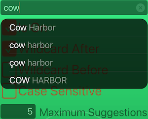
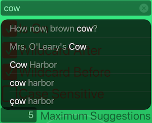
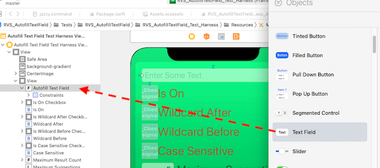
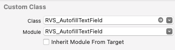
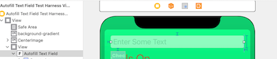
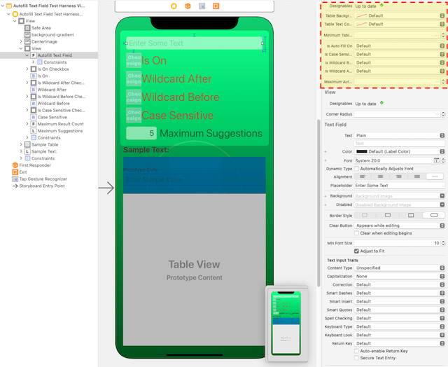

# RVS_AutofillTextField

## INTRODUCTION

This is a standard [`UITextField`](https://developer.apple.com/documentation/uikit/uitextfield), extended to provide an "autofill" dropdown menu, under the widget. This widget will provide matches, within an Array of Strings, which can be used as "autofill." If one of the strings is selected by the user, then it is entered, in its entirety, into the text field.

Figure 1: The Widget's Standard Display, with a "Begins With" Action

This is, by default, a simple, "one-way," "greedy" match. It starts from the beginning, then moves forward, matching the characters entered into the text field. They must all match, but the match can be case/diacritical-independednt (by default).

We can choose several modes of matching, so we can "wildcard" text before and/or after the string (or insist on an exact match).

Figure 2: The Widget's Standard Display, with a "Contains" Action

The widget has been designed to allow a lot of customization, as well as a very simple way to provide the data to be searched. It also has the ability to be modified for more advanced data searching.

The user must actuall select a table row. There is no "tab" autofill. This is for things like phones, where that doesn't really make sense, and the application may have other plans for the return function.

## WHAT PROBLEM DOES THIS SOLVE?

Entering text on phones isn't easy. This helps to reduce the amount of text we actually need to enter.

Additionally, this can help us to "explore" datasets, by entering partial specifications. For example, if we are searching for users in a certain area, we might do a "triage" search, and create a subset of the main database of users, for the locality. These can be used as autofill suggestions, when looking for a user.

## IMPLEMENTATION

### Where to Get the Package

You can get this package as a [Swift Package Manager](https://swift.org/package-manager/) (SPM) package, or you can include it, using [GitHub's Carthage Package Manager](https://github.com/Carthage/Carthage). Finally, you can also [directly access the GitHub repository](https://github.com/RiftValleySoftware/RVS_AutofillTextField), and simply include [the single source file](https://github.com/RiftValleySoftware/RVS_AutofillTextField/blob/master/Sources/RVS_AutofillTextField/RVS_AutofillTextField.swift) into your app.

#### The Swift Package Manager

In order to use the SPM, add the package to your project with its GitHub repo location:

    git@github.com:RiftValleySoftware/RVS_AutofillTextField.git (SSH),

or

    https://github.com/RiftValleySoftware/RVS_AutofillTextField.git (HTTPS).

Add the static `RVS_AutofillTextField` library to your project, and add the following `import` line to the top of the files that will use the widget:

    import RVS_AutofillTextField
    
#### Carthage

Add the following line to your [Cartfile](https://github.com/Carthage/Carthage/blob/master/Documentation/Artifacts.md#cartfile):

    github "RiftValleySoftware/RVS_AutofillTextField.git"
    
Then, run `carthage update` in the main project directory.

This will create a directory, called "Carthage". Inside of that, will be another directory, called `Checkins`. Inside of that, will be `RVS_AutofillTextField/Sources/RVS_AutofillTextField/RVS_AutofillTextField.swift`.

I recommend that you include this file directly into your app, as opposed to building the library, and adding that. If you do this, there will be no need to import a module. Additionally, the IBDesignables stuff should work (these are the previews in the storyboard file).

#### Directly From GitHub

The above Carthage instructions will also basically apply to getting the file from GitHub. You can use the following GitHub URLs to access the repository:

    git@github.com:RiftValleySoftware/RVS_AutofillTextField.git (SSH),

or

    https://github.com/RiftValleySoftware/RVS_AutofillTextField.git (HTTPS).

You can add the repo as a [Git Submodule](https://git-scm.com/book/en/v2/Git-Tools-Submodules), or even as a separate repo, that you use as a source for the physical file.

Get the same file, as indicated by Carthage, and add it to your project.

### Customizing the widget

You instantiate the control, in exactly the same way that you would, an instance of [`UITextField`](https://developer.apple.com/documentation/uikit/uitextfield). This can be done programmatically:

    var myTextEntryWidget = RVS_AutofillTextField(frame: widgetFrame)
    
or using Interface Builder, and a storyboard/IB file:

Figure 3: Dragging In A Text Field Object

Start by dragging in a Text Field.

Figure 4: Setting the Class (and Possibly, the Module).

Convert the Class to an instance of `RVS_AutofillTextField`. You may need to also set the module (if not directly including the file).

Figure 5: The Widget, in Its New Home.

It will now show up as a standard Text Field.

Figure 6: The Custom Widget Parameters.

These are the custom parameters for the `RVS_AutofillTextField` type.

Figure 7: The Standard Text Field Parameters.

But we also have the traditional Text Field controls.

---
**NOTE**

The dropdown menu attaches to the main root screen view, so it "floats" above everything else. **It is not modal.** You can still access everything behind it.

Also, the dropdown only appears when the widget has focus, and has text in it that matches the selections.

---

### Setting Up the Data Source

The widget won't work, without a data source. You can't add the data source via the storyboard. It needs to be done programmatically. This is because we did not want to force the user of this widget to have to start with an [`NSObject`](https://developer.apple.com/documentation/objectivec/nsobject)-based class (required to have the data source available via IB).

Once the widget has been installed/instantiated, it needs to be referenced by [an internal property](https://github.com/RiftValleySoftware/RVS_AutofillTextField/blob/master/Tests/RVS_AutofillTextField/RVS_AutofillTextField_Test_Harness/Sources/RVS_AutofillTextField_Test_Harness_ViewController.swift#L176), like so:

    /* ################################################################## */
    /**
     This is the CuT (Code Under Test). It is the test target instance of `RVS_AutofillTextField`.
     */
    @IBOutlet weak var autofillTextField: RVS_AutofillTextField!

[During the load setup, we should add the data source](https://github.com/RiftValleySoftware/RVS_AutofillTextField/blob/master/Tests/RVS_AutofillTextField/RVS_AutofillTextField_Test_Harness/Sources/RVS_AutofillTextField_Test_Harness_ViewController.swift#L223), like so:

    /* ################################################################## */
    /**
     Called when the view hierarchy has been loaded. We use this to sync the CuT with the UX.
     */
    override func viewDidLoad() {
        super.viewDidLoad()
        autofillTextField?.dataSource = self

The above examples were taken directly from [the test harness project](https://github.com/RiftValleySoftware/RVS_AutofillTextField/tree/master/Tests/RVS_AutofillTextField/RVS_AutofillTextField_Test_Harness). In that project, the main View Controller is also [the `RVS_AutofillTextFieldDataSource`-conformant Instance](https://github.com/RiftValleySoftware/RVS_AutofillTextField/blob/master/Sources/RVS_AutofillTextField/RVS_AutofillTextField.swift#L197).

### Conforming to the Data Source Protocol

[The `RVS_AutofillTextFieldDataSource` protocol](https://github.com/RiftValleySoftware/RVS_AutofillTextField/blob/master/Sources/RVS_AutofillTextField/RVS_AutofillTextField.swift#L190) is really very simple.

It requires that an Array of [a simple struct](https://github.com/RiftValleySoftware/RVS_AutofillTextField/blob/master/Sources/RVS_AutofillTextField/RVS_AutofillTextField.swift#L127) be supplied to the widget, which will then be used to provide the autofill "fuel."

Each instance of the struct will have two properties:

##### The value Property

This is a simple `String`. It has the full string to be searched, and, possibly, offered to replace the contents of the text field.

##### The refCon Property

This allows you to attach an arbitrary "reference context" to the element. This is how you can attach things like references to other properties or objects. It is an optional `Any?` value, defaulted to `nil`, so there is no need to define it. It's just there, for you.

This Array can be provided in one of two ways:

#### The Really Simple Way

By default, the data source protocol does a rather simple, naive search for matches. If we are happy with this, then all we need to do, is provide a property, [like so](https://github.com/RiftValleySoftware/RVS_AutofillTextField/blob/master/Tests/RVS_AutofillTextField/RVS_AutofillTextField_Test_Harness/Sources/RVS_AutofillTextField_Test_Harness_ViewController.swift#L242):

    /* ################################################################## */
    /**
     This is an Array of structs, that are the searchable data collection for the text field.
     If this is empty, then no searches will return any results.
     */
    var textDictionary: [RVS_AutofillTextFieldDataSourceType] {
        testingTextDictionary.compactMap {
            let currentStr = $0.trimmingCharacters(in: .whitespacesAndNewlines)
            return !currentStr.isEmpty ? RVS_AutofillTextFieldDataSourceType(value: currentStr) : nil
        }
    }

The protocol default will take care of searching and matching for us.

### The More Complex Way

If you want to have a way to optimize or otherwise filter/interpret the data being given to the widget, your data source can implement [the `getTextDictionaryFromThis(string inString: String, isCaseSensitive inIsCaseSensitive: Bool, isWildcardBefore inIsWildcardBefore: Bool, isWildcardAfter inIsWildcardAfter: Bool, maximumAutofillCount inMaximumAutofillCount: Int) -> [RVS_AutofillTextFieldDataSourceType]` method](https://github.com/RiftValleySoftware/RVS_AutofillTextField/blob/master/Sources/RVS_AutofillTextField/RVS_AutofillTextField.swift#L208)

This is called by the widget repeatedly, with a String, containing the current text contents, and returns a filtered and searched Array of elements.

You must implement at least one of the above methods. If you don't then you just have a normal `UITextField` instance.

### The Widget Options

The widget has a few optional fields that are available via the storyboard (Figure 6).

1. `isAutoFillOn`
This is a Bool value that is a "main circuit breaker" for the functionality. Default is on. If off, then the widget is just a regular `UITextField`.

2. `isCaseSensitive`
If this is on (default is off), then searches take case and diacriticals into account. If off, then the search ignores diacriticals and case.

3. `isWildcardBefore`
If this is on (default is off), then we ignore characters **before** the match, so the match can be further into the string. It does not need to start the string.

4. `isWildcardAfter`
If this is on (default is on), then characters **after** the match are ignored.

5. `maximumAutofillCount`
This is an integer value that designates the maximum number of results that show up in the table. If it is set to -1 (or any negative number), then there will be no limit, and the table could get quite large (and scroll). Default is 5.

If you are looking for an exact match, then turn off both wildcards. If you make it case-sensitive, then the string must match exactly.

If you are looking for a case-insensitive match at the start, just leave the defaults. If you are looking for an "ends with" match, then turn on the before wildcards, and turn off the after wildcards.