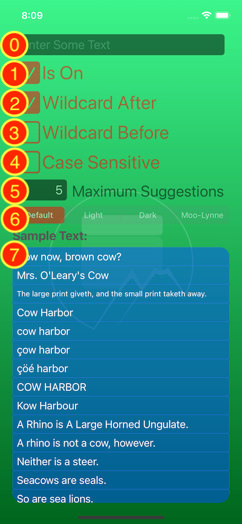

# RVS_AutofillTextField_Test_Harness

## INTRODUCTION

This is the test harness app for [the RVS_AutofillTextField project](https://github.com/RiftValleySoftware/RVS_AutofillTextField/). It is a simple, standalone, iOS native Swift app, based on the [standard (classic) UIKit](https://developer.apple.com/documentation/uikit) model.

## REQUIREMENTS

There are no dependencies to use the widget, itself, but there are a couple that are required for this test harness:

1. [`RVS_Checkbox`](https://github.com/RiftValleySoftware/RVS_Checkbox)
2. [`RVS_GeneralObserver`](https://github.com/RiftValleySoftware/RVS_GeneralObserver)

The test harness builds [a dynamic framework](https://developer.apple.com/library/archive/documentation/DeveloperTools/Conceptual/DynamicLibraries/100-Articles/OverviewOfDynamicLibraries.html) of the widget, and imports it, in order to provide a relevant usage example, similar to use of the widget via [the Swift Package Manager](https://swift.org/package-manager/).

## USAGE

### The Main Screen

*Figure 1: The Main Screen, Itemized*

#### List of Elements

The screen has a bunch of controls, meant to affect the autofill text field, and the text field, itself, at the top.

The instance of `RVS_AutofillTextField` is indicated by a "0." This is what will be tested by the harness. All the other items manipulate properties of that text field instance:

1. The Main "On/Off" Switch.
If this is on (default), then the test instance will act as an `RVS_AutofillTextField`. If it is off, then the instance will act as a standard [`UITextField`](https://developer.apple.com/documentation/uikit/uitextfield).

2. The "Wildcard After" Switch
If this is on (default), then any characters after the match, in the main text box will be ignored. If the "Wildcard Before" switch is off, then the string must begin with the match.

3. The "Wildcard Before" Switch
If this is on (default is off), then any characters before the match, in the main text box will be ignored. If the "Wildcard After" switch is off, then the string must end with the match.

4. The "Case Sensitive" Switch
If this is on (default is off), then the characters must match the string, according to case. Additionally, diacrtiticals are matched. If this is off, then diacriticals are ignored.

5. The Maximum Count TextField
This allows you to specify the maximum number of matches to display in the dropdown. -1 means the dropdown will display every match it gets. The vertical size of the dropdown is dynamic, and will extend to the bottom of the screen, if necessary. The table can be scrolled.

6. The Color Theme Segmented Switch
This allows the user to select a color theme for the dropdown menu. The control, itself, uses the standard UITextView color options.

7. The Match Samples.
These are the strings that are searched for matches. They are also each editable TextFields, so you can change them.

## LICENSE

MIT License

Copyright (c) 2021 Rift Valley Software, Inc.

Permission is hereby granted, free of charge, to any person obtaining a copy
of this software and associated documentation files (the "Software"), to deal
in the Software without restriction, including without limitation the rights
to use, copy, modify, merge, publish, distribute, sublicense, and/or sell
copies of the Software, and to permit persons to whom the Software is
furnished to do so, subject to the following conditions:

The above copyright notice and this permission notice shall be included in all
copies or substantial portions of the Software.

THE SOFTWARE IS PROVIDED "AS IS", WITHOUT WARRANTY OF ANY KIND, EXPRESS OR
IMPLIED, INCLUDING BUT NOT LIMITED TO THE WARRANTIES OF MERCHANTABILITY,
FITNESS FOR A PARTICULAR PURPOSE AND NONINFRINGEMENT. IN NO EVENT SHALL THE
AUTHORS OR COPYRIGHT HOLDERS BE LIABLE FOR ANY CLAIM, DAMAGES OR OTHER
LIABILITY, WHETHER IN AN ACTION OF CONTRACT, TORT OR OTHERWISE, ARISING FROM,
OUT OF OR IN CONNECTION WITH THE SOFTWARE OR THE USE OR OTHER DEALINGS IN THE
SOFTWARE.
